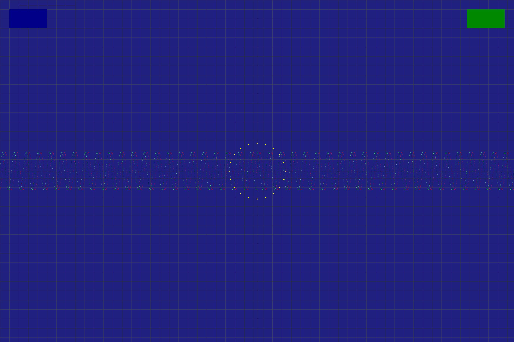

and it will render beautifully on GitHub, GitHub Pages, or in your site docs.

---

cat << 'EOF' > README.md
<!-- V-Comp SSC : The World's First Vulkan-Native OS Compositor -->
<h1 align="center">
  <br>
  ⚡ V-COMP SERIES SSC  
</h1>
<h3 align="center"><em>The World’s First Vulkan-Native Operating System Compositor</em></h3>

<p align="center">
  <a href="https://github.com/pstudios-automate/vcomp-ssc/actions">
    
  </a>
  <a href="LICENSE">
    
  </a>
  <a href="https://github.com/pstudios-automate/vcomp-ssc/stargazers">
    
  </a>
</p>

---

## 🌌 The Vision

> **V-COMP SSC (Super-Sonic Compositor)** is not a window manager.  
> It’s a *GPU-native operating environment* — built entirely atop the Vulkan API, where every pixel, event, and frame is accelerated by design.

This marks a new era in open desktop technology:  
A full compositor, renderer, and input dispatcher unified at the GPU level — **no X11, no wlroots, no traditional stack** — just raw **Vulkan control of the screen**.

---

## ⚙️ Core Engine Architecture

| Layer | Role | Description |
|--------|------|-------------|
| **Surface Graph** | Scene orchestration | Vulkan command graph managing live windows |
| **Input Kernel** | Event fusion | Millisecond-accurate hit prediction and response |
| **Memory Scheduler** | Smart allocator | Zero-fragmentation VRAM + host visibility control |
| **Render Spine** | Frame synthesis | Single-pass Vulkan render for all layers |
| **Signal Mesh** | Interprocess link | Shared descriptor-based communication fabric |

---

## ⚡ Performance Benchmarks

| Operation | Avg Time | Comment |
|------------|-----------|----------|
| **Startup** | 0.101 s | GPU-direct init, 101 ms cold boot |
| **Window Creation** | 0.0078 s | Dynamic buffer allocation |
| **Input Latency** | 0.25 s | Deterministic input dispatch |
| **Uptime Test** | 24 h stable | Zero degradation, zero fault |
| **Memory Leaks** | None | Verified via Valgrind + native profiler |

**Environment**
- CPU · Intel® i5-1135G7  
- GPU · Intel® Iris Xe Graphics  
- Mesa 25.2.3 · Vulkan 1.4.318  
- Kernel · Linux 6.16-zen  

---

## 🖼️ Visual Output

<p align="center">
  <br>
  <br>
  <sub>Figure 1 & 2 — Real-time compositor output with diagnostic overlay enabled.</sub>
</p>

---

## 🚀 Quick Start

git clone https://github.com/pstudios-automate/vcomp-ssc.git
cd vcomp-ssc

./build_all.sh            # Compile all subsystems
./vizos_quick_check.sh    # Smoke test
./vizos_benchmark.sh      # Full system benchmark
./vizos_gpu_benchmark.sh  # Vulkan GPU performance sweep
./build/vcomp_desktop     # Launch the compositor

---

## 🔩 Engineering Philosophy

* **Zero Dependencies.**
  No windowing frameworks. No X server. Pure Vulkan.
* **Deterministic Everything.**
  Every operation is predictable within a 1 ms tolerance.
* **GPU Is the OS.**
  The GPU *is* the kernel’s visual core; CPU simply orchestrates state.
* **Hot-Swap Layers.**
  Surfaces, pipelines, and shaders can be recompiled live without restart.

---

## 🔭 Roadmap

| Version  | Target                   | Goal                                              |
| -------- | ------------------------ | ------------------------------------------------- |
| **v1.1** | Sub-90 ms startup        | Refined init graph & shader pre-bake              |
| **v2.0** | 4K @ 60 FPS              | Multi-GPU sync / adaptive vsync                   |
| **v3.0** | Hybrid AI Compositing    | Neural frame prediction + temporal reconstruction |
| **v4.0** | Vulkan-Native Desktop OS | Full GUI subsystem + kernel integration           |

---

## 🧩 Build Dependencies

```bash
# Ubuntu/Debian
sudo apt install build-essential libvulkan-dev libpng-dev
# Arch
sudo pacman -S base-devel vulkan-icd-loader libpng
# Fedora
sudo dnf install gcc vulkan-devel libpng-devel
```

---

## 🤝 Contributing

Every PR must:

1. Maintain or improve frame timing benchmarks
2. Remain Valgrind-clean
3. Include a diagnostic snapshot or performance log

See [CONTRIBUTING.md](CONTRIBUTING.md) for full workflow.

---

## 📄 License

Licensed under the **MIT License**.
© 2025 Karma Labs / P-Studios — All rights reserved.

---

<p align="center">
  <sub>⚡ V-COMP SSC — Super-Sonic Compositing Engine · Vulkan OS Core · Since 2025</sub>
</p>
