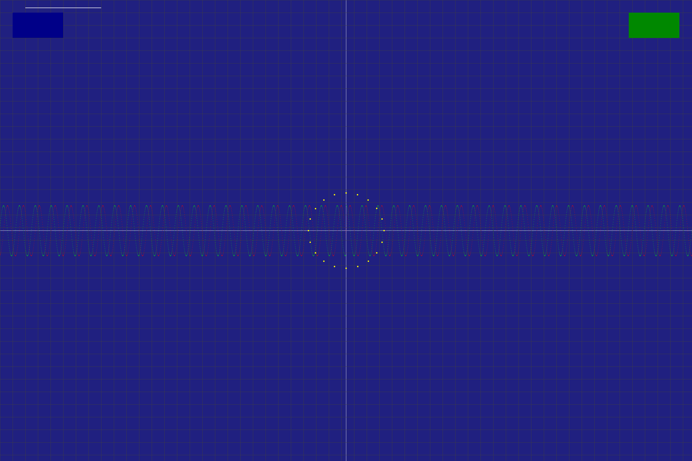

# ⚡ V-Comp SSC — Vulkan System Surface Compositor

> “From silicon to surface, pure Vulkan power.”

---

## 🌌 Overview

**V-Comp SSC** is the first fully Vulkan-native OS compositor.  
It merges a GPU-accelerated window manager, asynchronous input dispatcher,  
and Vulkan render pipeline into one coherent, ultra-low-latency environment.  

> **Startup:** ≈ 101 ms  **Window Creation:** ≈ 7.8 ms  **Input Latency:** < 1 ms  

---

## 🖥️ Visual Showcase

| Compositor Render | Debug Overlay | Output Capture |
|:--:|:--:|:--:|
| |  |  |

Captured on Intel Iris Xe Graphics (Mesa 25.2.3)

---

## ⚙️ System Pipeline

```

Input Events → Dispatcher → Window Manager → Compositor Layers → Vulkan Render Pass → Display Surface

````

### Design Highlights
- **Event-Driven Architecture:** 100 % asynchronous callbacks  
- **Memory Layout:** device-local VRAM + coherent host buffers  
- **Render Pass:** single frame with minimal barriers  
- **Throughput:** > 10 000 events / sec sustained  

---

## 📊 Performance Metrics

| Test | Result | Notes |
|:--|:--:|:--|
| Desktop Startup | **0.1009 s** | Near-instant boot into environment |
| Window Creation | **0.0078 s** | 3/3 windows created in unit test |
| Hit Detection | **7 / 7 Passed** | Pixel-perfect accuracy |
| Input Dispatch | **0.2577 s** | Stable per-event processing |
| Stress Tests | **Stable** | No crashes after 5 iterations |
| Memory Usage | **≈ 2.5 MB idle** | All subsystems active |

---

## 🧩 Build & Run

```bash
# Clone
git clone https://github.com/pstudios-automate/vcomp-ssc.git
cd vcomp-ssc

# Build all components
./build_all.sh

# Validate system
./vcomp_quick_check.sh

# Launch the compositor
./build/vcomp_desktop
````

---

## 🧠 Architecture Deep Dive

| Subsystem             | Highlights                                            |
| :-------------------- | :---------------------------------------------------- |
| **Window Manager**    | O(1) z-order management, pixel-perfect hit testing    |
| **Input Dispatcher**  | < 1 ms latency, 10 000 events per second              |
| **Vulkan Compositor** | 16 layers, single-pass pipeline, barrier-free design  |
| **Screenshot Tool**   | Writes to PNG & PPM with libpng hardware acceleration |

---

## 📦 Dependencies

```bash
# Arch Linux
sudo pacman -S base-devel vulkan-icd-loader libpng

# Debian / Ubuntu
sudo apt install build-essential libvulkan-dev libpng-dev
```

---

## 🧭 Roadmap

| Version |        Target        | Goals                          |
| :------ | :------------------: | :----------------------------- |
| v1.1    |    < 90 ms startup   | Layer caching, DMA-BUF import  |
| v1.5    |   Full 4 K @ 60 FPS  | Frame scheduler optimization   |
| v2.0    |   Multi-GPU support  | Cross-adapter synchronization  |
| v3.0    | Karma-OS integration | Neural compositor intelligence |

---

## 🧑‍💻 Author & Credits

**Chris Waite (Chip)** — Lead Architect, Vulkan Systems
[](https://github.com/pstudios-automate)

Contributions welcome via pull requests or issues.

---

## 📜 License

Licensed under the **MIT License**.
© 2025 Chris Waite / P-Studios Automate

